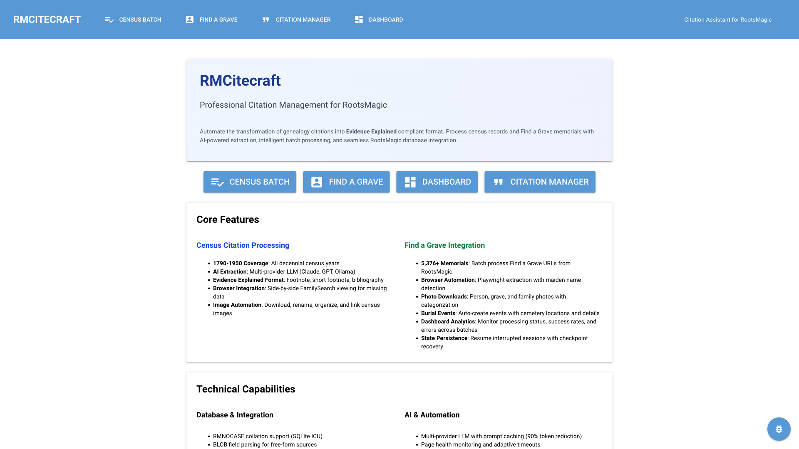
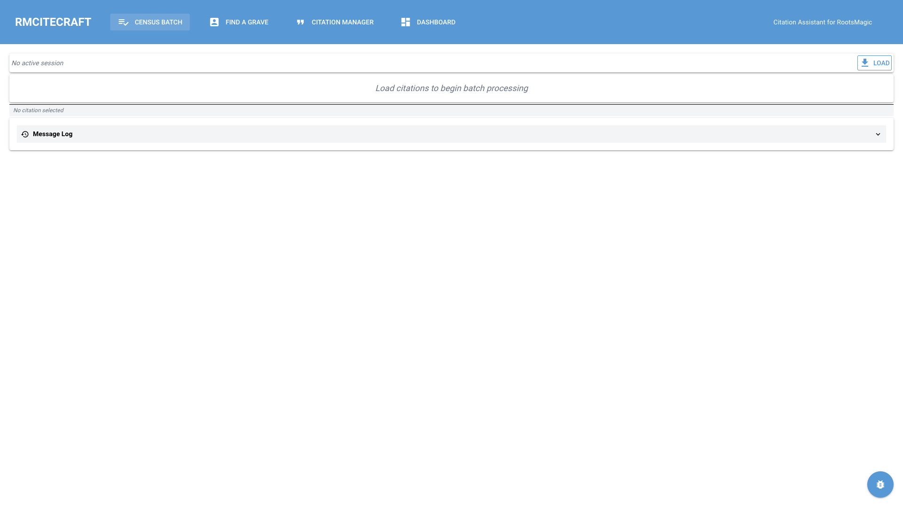
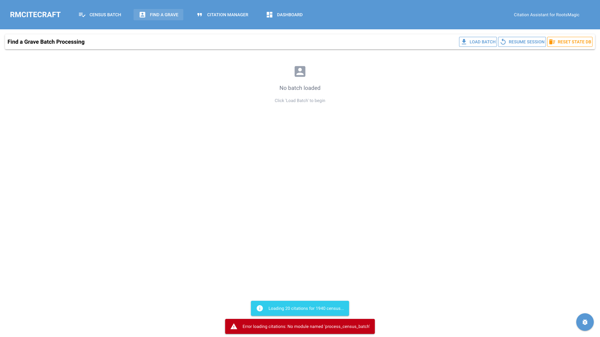
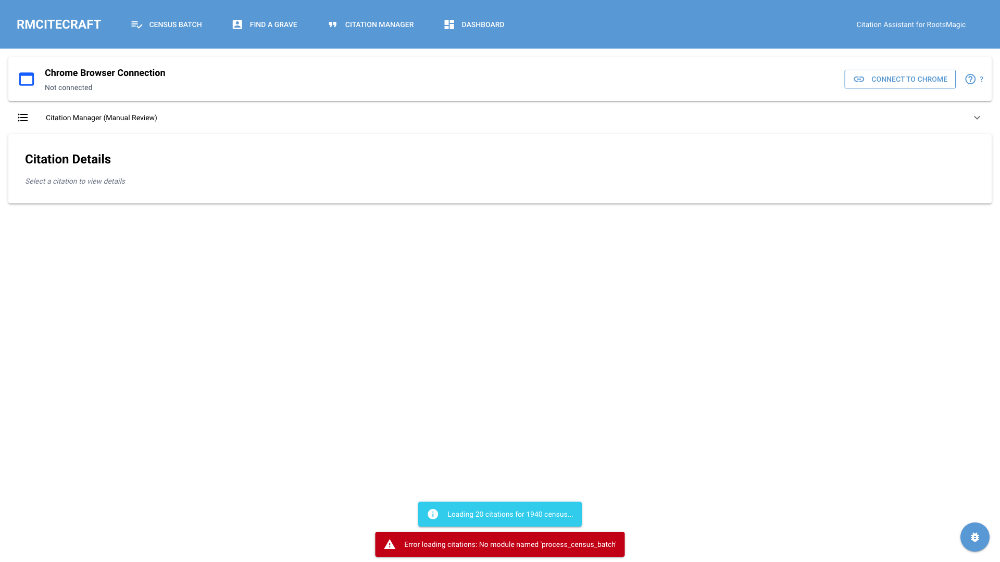
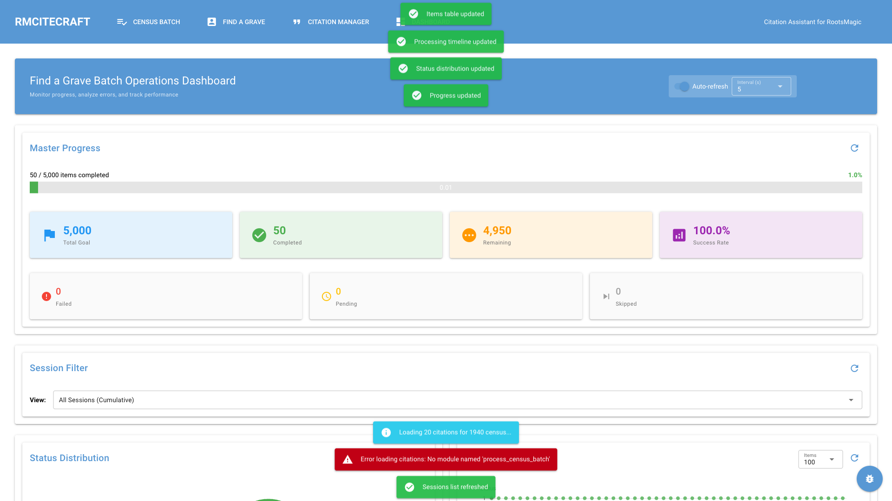

# RMCitecraft User Journey Map

**Version**: 1.0
**Last Updated**: 2025-11-20
**Purpose**: Comprehensive documentation of all user workflows and UI interfaces in RMCitecraft

This document maps all user journeys through the RMCitecraft application, including frequently used workflows and less-common interfaces like place validation.

---

## Table of Contents

1. [Application Overview](#application-overview)
2. [Entry Point: Home Page](#entry-point-home-page)
3. [Journey 1: Census Batch Processing](#journey-1-census-batch-processing)
4. [Journey 2: Find a Grave Batch Processing](#journey-2-find-a-grave-batch-processing)
5. [Journey 3: Citation Management](#journey-3-citation-management)
6. [Journey 4: Batch Operations Monitoring](#journey-4-batch-operations-monitoring)
7. [Less-Used Interfaces](#less-used-interfaces)
8. [Error States and Recovery](#error-states-and-recovery)

---

## Application Overview

**RMCitecraft** is a macOS desktop application that automates citation formatting and image management for genealogy records in RootsMagic databases.

### Core Workflows

1. **Census Batch Processing**: Transform FamilySearch citations to Evidence Explained format
2. **Find a Grave Batch Processing**: Extract memorial data and create burial citations
3. **Citation Management**: Review, edit, and apply citations to RootsMagic database
4. **Dashboard Monitoring**: Track batch operation progress and analyze results

### Navigation Structure

```
Home Page (Default)
├── Census Batch Processing Tab
├── Find a Grave Batch Processing Tab
├── Citation Manager Tab
└── Dashboard Tab
```

---

## Entry Point: Home Page

### Purpose
Landing page providing system status, configuration summary, and quick access to documentation.

### UI Elements

**Header Navigation**:
- Census Batch button
- Find a Grave button
- Citation Manager button
- Dashboard button
- Settings icon (top-right)

**Main Content**:
- Application title and version
- System status indicators
  - RootsMagic database connection status
  - Chrome browser connection status
  - LLM provider status (Anthropic Claude)
- Configuration summary
  - Database path
  - Media directories
  - Output settings
- Quick start links
  - Documentation
  - Feature guides
  - Troubleshooting

### User Actions
- Click tab buttons to navigate to workflows
- Click settings icon to open configuration dialog
- Review system status before beginning work

### Screenshot


---

## Journey 1: Census Batch Processing

### Overview
Transform FamilySearch placeholder citations into Evidence Explained compliant format for US Federal census records.

### User Persona
Genealogist with 20-500 census citations needing proper formatting for a research publication or family tree.

### User Goals
- Load batch of FamilySearch citations from RootsMagic database
- Extract census data (ED, sheet, line, etc.) via LLM
- Fill in missing data from FamilySearch images
- Generate Evidence Explained citations (Footnote, Short Footnote, Bibliography)
- Apply citations back to RootsMagic database

### Workflow Steps

#### Step 1: Navigate to Census Batch Tab
**Action**: Click "Census Batch" in top navigation
**Result**: Census Batch Processing interface loads

#### Step 2: Load Citation Batch
**UI State**: Empty state with "Load" button
**Action**: Click "Load" button
**Dialog**: Batch size selector appears
- Input: Number of citations (default: 20, max: 500)
- Input: Offset (starting position, default: 0)
- Button: Cancel | Load

**Screenshot**:


#### Step 3: Citation Queue Displays
**UI Layout**: 3-panel horizontal layout
- **Left Panel (30%)**: Citation Queue
  - List of loaded citations
  - Status indicators (✓ Complete, ⚠ Needs Review, ⏳ Queued)
  - Click to select citation
  - Multi-select checkboxes

- **Center Panel (40%)**: Data Entry Form
  - Displays missing required fields
  - Input fields with placeholders and hints
  - Live validation feedback
  - "Update" button to save changes

- **Right Panel (30%)**: Image Viewer
  - FamilySearch census image display
  - Zoom controls
  - Pan and navigate

**Screenshot**:


#### Step 4: Select Citation
**Action**: Click citation in queue
**Result**:
- Citation highlights in queue
- Data entry form shows missing fields for selected citation
- Image viewer loads FamilySearch image (if available)

#### Step 5: Fill Missing Data
**Data Entry Fields** (vary by census year):
- Enumeration District (ED) - Format: "96-413"
- Sheet Number - e.g., "9"
- Line Number - e.g., "75"
- Family Number - e.g., "57" (1850-1940)
- Dwelling Number - e.g., "42" (1850-1880)
- Township/Ward - e.g., "Olive Township"

**User Actions**:
1. View FamilySearch image in right panel
2. Locate person on census page
3. Enter required data in center panel
4. Live preview shows generated citations
5. Click "Update" button

**Validation**:
- Required fields highlighted if missing
- Format validation (ED pattern, numeric fields)
- Warning icons for validation errors

#### Step 6: Process Batch
**Action**: Click "Process Batch" button (top-right)
**Progress Dialog**: Shows processing status
- Current item name
- Progress bar (X of Y)
- Status: Extracting → Formatting → Writing to database

**Batch Operations**:
- LLM extraction for each citation
- Template-based formatting
- Database writes (atomic transactions)
- Error handling and retry logic

#### Step 7: Review Results
**Completion Summary**:
- X of Y citations processed successfully
- Errors: Z citations failed
- Link to error log

**Next Actions**:
- Review failed citations
- Load next batch
- Navigate to Citation Manager to verify results

### Key UI Components

**Citation Queue Item**:
```
┌────────────────────────────────────────┐
│ ☐ [Status Icon] PersonID 856          │
│   Ella Ijams                           │
│   1900, Ohio, Noble                    │
│   Source: Fed Census: 1900...         │
└────────────────────────────────────────┘
```

**Data Entry Form**:
```
Missing Required Fields
┌────────────────────────────────────────┐
│ Enumeration District (ED):             │
│ [___________] Format: "XX-XXX"         │
│                                        │
│ Sheet Number:                          │
│ [___________] Sheet or page number     │
│                                        │
│ Line Number:                           │
│ [___________] Line number on page      │
│                                        │
│              [Update Button]           │
└────────────────────────────────────────┘
```

### Edge Cases

**No Missing Fields**: Form shows "✅ All required fields complete"
**LLM Extraction Fails**: User prompted to enter all data manually
**Validation Errors**: Red warning messages below fields
**Image Not Available**: Image viewer shows placeholder message

---

## Journey 2: Find a Grave Batch Processing

### Overview
Extract memorial data from Find a Grave and create burial citations with cemetery locations.

### User Persona
Genealogist processing Find a Grave memorials for deceased ancestors, creating citations and downloading memorial photos.

### User Goals
- Load batch of people with Find a Grave URLs
- Extract memorial data (cemetery, location, photos, family members)
- Create Evidence Explained burial citations
- Validate cemetery locations (or add new places)
- Download memorial photos
- Link citations to RootsMagic burial events

### Workflow Steps

#### Step 1: Navigate to Find a Grave Tab
**Action**: Click "Find a Grave" in top navigation
**Result**: Find a Grave Batch Processing interface loads

#### Step 2: Load Memorial Batch
**UI State**: Empty state with action buttons
**Action**: Click "Load Batch" button

**Batch Size Dialog**:
- Number of people to load (default: 20, max: 500)
- Offset: Skip first N people (default: 0)
- Buttons: Cancel | Load

**Screenshot**:


#### Step 3: Memorial Queue Displays
**UI Layout**: 2-panel horizontal layout

**Left Panel (35%)**: Memorial Queue
- List of loaded memorials
- Status indicators:
  - ⏳ Queued (pending)
  - 🔄 Extracting (in progress)
  - ✓ Complete (success)
  - ✗ Error (failed)
  - ⚠ Needs Review (requires user action)
- Multi-select checkboxes
- "Select All" | "Clear" buttons

**Right Panel (65%)**: Person Detail
- Memorial information
  - Memorial ID
  - Find a Grave URL
  - Person name and dates
- Extracted data (after extraction):
  - Cemetery name
  - Location (City, County, State, Country)
  - Contributor information
- Generated citations (Evidence Explained format)
- Photos section
  - Photo type (Person, Grave, Family, Other)
  - Description
  - Contributor and date
  - "Download" button for each photo
- "Extract Data" button (if queued)

#### Step 4: Select Memorial
**Action**: Click memorial in queue
**Result**:
- Memorial highlights in queue
- Person detail panel shows memorial info and URL

#### Step 5: Extract Memorial Data
**Action**: Click "Extract Data" button
**Process**:
1. Browser automation navigates to Find a Grave memorial page
2. Data extraction via Playwright selectors
3. Structured data returned:
   - Person name (as shown on memorial)
   - Cemetery name and location
   - Photos (with metadata)
   - Family members mentioned
   - Contributor info

**Result**: Person detail panel updates with extracted data

#### Step 6: Validate Cemetery Location
**Trigger**: During batch processing, if cemetery location is new
**Dialog**: Place Approval Dialog (see [Place Validation Interface](#place-validation-interface))

**User Decision**:
- Add new place (creates location + cemetery in RootsMagic)
- Select existing place (links to existing RootsMagic location)
- Abort batch (stops processing)

#### Step 7: Download Photos
**Manual Download** (before batch processing):
- Click "Download" button next to photo
- Photo saved to appropriate directory:
  - Person photos → `~/Genealogy/RootsMagic/Files/Pictures - People/`
  - Grave photos → `~/Genealogy/RootsMagic/Files/Pictures - Cemetaries/`
  - Family photos → `~/Genealogy/RootsMagic/Files/Pictures - People/`
  - Other → `~/Genealogy/RootsMagic/Files/Pictures - Other/`
- Filename format: `Surname, GivenName YYYY-YYYY.jpg`

**Auto-Download** (during batch processing):
- Checkbox: "Auto-download images" (enabled by default)
- Downloads all photos for each memorial automatically
- Creates media records in RootsMagic database
- Links photos to citation and burial event

#### Step 8: Process Batch
**Action**: Click "Process" button (top-right)

**Batch Processing Steps** (per memorial):
1. **Page Health Check** - Verify browser page is responsive
2. **Duplicate Check** - Skip if citation already exists
3. **Extraction** - Extract memorial data with retry logic
4. **Citation Formatting** - Generate Evidence Explained citations
5. **Database Writes**:
   - Create source and citation
   - Link citation to person
   - Link citation to parent families (if family members mentioned)
   - Create burial event with cemetery location
   - Download and link photos (if enabled)
6. **State Persistence** - Save progress for crash recovery

**Progress Dialog**:
- Current memorial: "Processing X of Y: [Name]"
- Progress bar
- Status messages (Extracting → Formatting → Writing → Downloading)
- Health indicators (page status, timeouts)

**Crash Recovery**:
- Session state saved to SQLite database
- Automatic recovery if browser crashes
- Resume from last checkpoint

#### Step 9: Review Results
**Completion Summary**:
- Citation matching report (spouse and parent links)
- Image download summary (total images, breakdown by type)
- Session statistics (success rate, timing metrics)

**Resume Session**:
- Click "Resume Session" button
- Select previous session to continue
- Resumes from last processed memorial

### Key UI Components

**Memorial Queue Item**:
```
┌────────────────────────────────────────┐
│ ☐ [Status Icon]                       │
│   William H Ijams                      │
│   1865-1943                            │
│   PersonID 7464 | Memorial #123456789 │
└────────────────────────────────────────┘
```

**Person Detail Panel**:
```
[William H Ijams] (1865-1943)     [Extract Data Button]

Memorial Information
┌────────────────────────────────────────┐
│ Memorial ID: 123456789                 │
│ URL: https://findagrave.com/...        │
└────────────────────────────────────────┘

Extracted Data
┌────────────────────────────────────────┐
│ Cemetery: Mt. Calvary Cemetery         │
│ Location: Baltimore, Maryland          │
│ Contributor: John Smith (2020)         │
└────────────────────────────────────────┘

Generated Citations (Evidence Explained)
┌────────────────────────────────────────┐
│ Footnote: Mt. Calvary Cemetery...      │
│ Short Footnote: Mt. Calvary Cem....    │
│ Bibliography: Maryland. Baltimore...   │
└────────────────────────────────────────┘

Photos (2)
┌────────────────────────────────────────┐
│ 👤 Person Photo                        │
│    "William H Ijams headstone"         │
│    Added by: John Smith (2020)         │
│                          [Download]    │
│                                        │
│ 🪦 Grave Photo                         │
│    "Headstone close-up"                │
│    Added by: Jane Doe (2021)           │
│                          [Download]    │
└────────────────────────────────────────┘
```

### Edge Cases

**No Cemetery Found**: Warning logged, burial event skipped
**Duplicate Citation Exists**: Memorial skipped with warning message
**Browser Page Crash**: Automatic recovery attempt
**Extraction Timeout**: Retry with adaptive timeout
**Photo Download Fails**: Warning logged, processing continues

---

## Journey 3: Citation Management

### Overview
Review generated citations before applying to RootsMagic database, with side-by-side editing and validation.

### User Persona
Genealogist reviewing batch-generated citations for accuracy before final database write.

### User Goals
- Connect to Chrome browser for FamilySearch access
- Review pending citations
- Edit citation data if needed
- Validate against FamilySearch images
- Apply citations to RootsMagic database

### Workflow Steps

#### Step 1: Navigate to Citation Manager
**Action**: Click "Citation Manager" in top navigation
**Result**: Citation Manager interface loads

**Screenshot**:


#### Step 2: Connect to Chrome
**UI State**: "Connect to Chrome" button visible
**Action**: Click "Connect to Chrome"

**Connection Process**:
1. Chrome DevTools Protocol (CDP) detection
2. Finds Chrome instance with `--remote-debugging-port=9222`
3. Establishes browser automation connection
4. Status indicator updates to "✓ Connected"

**Prerequisites**:
- Chrome must be launched with: `--remote-debugging-port=9222`
- Recommended: User logged into FamilySearch in Chrome

#### Step 3: Load Pending Citations
**UI Layout**: 2-panel horizontal layout

**Left Panel (40%)**: Pending Citations Queue
- List of citations awaiting review
- Status: Pending | Ready to Apply | Applied | Error
- Click to select citation

**Right Panel (60%)**: Citation Detail
- Citation metadata (Person, Source, Census year/location)
- Extracted data (ED, sheet, line, etc.)
- Generated citations preview
- Edit button for data entry form
- "Apply to Database" button

#### Step 4: Review Citation
**Action**: Click citation in queue
**Result**: Citation detail panel shows generated citations

**Citation Preview**:
- Footnote (full citation)
- Short Footnote (subsequent citations)
- Bibliography (bibliography entry)

#### Step 5: Edit If Needed
**Action**: Click "Edit" button
**Result**: Data entry form appears
**User Can**:
- Modify extracted data fields
- Add missing information
- Fix validation errors
- See live preview of citations update

#### Step 6: Apply to Database
**Action**: Click "Apply to Database" button
**Confirmation**: "Apply citation for [Person Name]?"
**Process**:
1. Validate citation data
2. Write to RootsMagic database (SourceTable.Fields BLOB for free-form citations)
3. Update CitationTable with metadata
4. Mark citation as "Applied" in queue

**Result**:
- Success notification
- Citation status updates to "✓ Applied"
- Moves to next pending citation

### Key UI Components

**Pending Citations Queue Item**:
```
┌────────────────────────────────────────┐
│ [Status Icon] Ella Ijams               │
│ 1900 U.S. census, Noble County, Ohio  │
│ PersonID 856                           │
└────────────────────────────────────────┘
```

**Citation Detail Panel**:
```
Ella Ijams (PersonID 856)
1900 U.S. census, Noble County, Ohio

Extracted Data
┌────────────────────────────────────────┐
│ ED: 95                                 │
│ Sheet: 3B                              │
│ Family: 57                             │
│ Township: Olive Township               │
└────────────────────────────────────────┘

Generated Citations
┌────────────────────────────────────────┐
│ Footnote:                              │
│ 1900 U.S. census, Noble County...     │
│                                        │
│ Short Footnote:                        │
│ 1900 U.S. census, Noble Co., Oh...    │
│                                        │
│ Bibliography:                          │
│ U.S. Ohio. Noble County. 1900 U.S...  │
└────────────────────────────────────────┘

                 [Edit] [Apply to Database]
```

---

## Journey 4: Batch Operations Monitoring

### Overview
Monitor Find a Grave batch processing progress with real-time analytics and drill-down capabilities.

### User Persona
Genealogist running large batch operations (100-500 memorials) wanting to track progress and identify outliers.

### User Goals
- Monitor batch processing progress
- View success/error distribution
- Identify slow-processing items
- Drill down to individual memorial details
- Export batch results

### Workflow Steps

#### Step 1: Navigate to Dashboard
**Action**: Click "Dashboard" in top navigation
**Result**: Dashboard loads with all monitoring components

**Screenshot**:


#### Step 2: View Master Progress
**Component**: Master Progress Card
**Data Displayed**:
- Total items processed (all sessions)
- Completion percentage
- Error count
- Average processing time

#### Step 3: Select Session
**Component**: Session Selector Card
**Data Displayed**:
- List of batch sessions (most recent first)
- Session ID, date, total items
- Status: In Progress | Completed | Error

**Action**: Click session to filter dashboard
**Result**: All charts update to show selected session data

#### Step 4: Analyze Status Distribution
**Component**: Status Distribution Pie Chart
**Data Displayed**:
- Completed (green)
- Failed (red)
- Pending (blue)

**Interaction**: Click pie slice to filter items table

#### Step 5: Review Processing Timeline
**Component**: Processing Timeline Scatter Chart
**Axes**:
- X: Processing order (sequence)
- Y: Status (Completed=1, Failed=0, Pending=0.5)

**Data Points**:
- Each memorial as a point
- Color-coded by status
- Tooltip shows: Person name, PersonID, timestamp, status

**Interaction**: Click point to show item detail panel

#### Step 6: Drill Down to Items
**Component**: Items Table
**Columns**:
- Person Name
- PersonID
- Memorial ID
- Status
- Processing Time
- Error Message (if failed)

**Features**:
- Searchable/filterable
- Sortable columns
- Click row to show detail panel

#### Step 7: View Item Details
**Component**: Item Detail Panel
**Data Displayed**:
- RootsMagic person details (name, dates, relationships)
- Memorial information
- Extracted data
- Generated citations
- Error details (if failed)
- Linked photos

### Dashboard Phases

**Phase 1: Overview**
- Master Progress Card
- Session Selector Card

**Phase 2: Charts**
- Status Distribution Chart (left)
- Processing Timeline Chart (right)

**Phase 3: Detail**
- Items Table (left)
- Item Detail Panel (right)

**Phase 4: Analytics** (Coming Soon)
- Error Analysis (tree map of error types)
- Performance Heatmap (processing time distribution)

**Phase 5+: Advanced** (Coming Soon)
- Outlier Detection
- Cumulative Analytics
- Export Tools

### Auto-Refresh

**Controls**:
- Toggle: Auto-refresh On/Off
- Interval: 5s | 10s | 30s | 60s
- Manual "Refresh Now" button

**Behavior**:
- Dashboard updates automatically at set interval
- Session selector refreshes
- Charts and tables update with new data

---

## Less-Used Interfaces

### Place Validation Interface

**Context**: During Find a Grave batch processing, when a new cemetery location is encountered
**Trigger**: Cemetery name/location not found in RootsMagic PlaceTable
**Purpose**: Validate new burial location before adding to database

#### Dialog Structure

**Place Approval Dialog** (Modal, Persistent)

**Header**: "Burial Place Approval Required"

**Section 1: Find a Grave Information** (Blue card)
- Cemetery: [Cemetery Name]
- Location: [City, County, State, Country]
- Person: [Full Name]

**Section 2: Proposed New Place** (Green card)
- Location: [City, County, State, Country]
- Cemetery: [Cemetery Name]

**Section 3: Gazetteer Validation** (Color-coded by confidence)
- **High Confidence** (Green card):
  - ✓ Icon: `check_circle`
  - All components validated
  - Example: "4/4 components validated - high confidence"

- **Medium Confidence** (Yellow card):
  - ⚠ Icon: `warning`
  - Some components validated
  - Example: "2/4 components validated - medium confidence"

- **Low Confidence** (Orange card):
  - ⚠️ Icon: `error_outline`
  - Few/no components validated
  - Example: "0/4 components validated - low confidence"

**Component Validation Details**:
```
✓ City: Baltimore (fuzzy)
✓ County: Baltimore
✓ State: Maryland
✓ Country: United States
```

or

```
✗ City: Baltimor (not found)
✓ County: Baltimore
✓ State: Maryland
✓ Country: United States
```

**Section 4: Existing Places** (Sortable table)

**Table Columns**:
- Place Name (full hierarchy)
- Combined Score (bold, primary sort)
- PlaceTable Match (similarity percentage)
- Usage (usage count in database)

**Table Features**:
- Single-row selection
- Sortable by any column
- Initially sorted by Combined Score (descending)
- Row click selects place

**Example Row**:
```
| Mt. Calvary Cemetery, Baltimore, Maryland, USA | 95 | 92.5% | 12 |
```

**Section 5: Action Buttons** (Right-aligned)
- **Add New Place** (Primary, blue)
  - Creates new location in PlaceTable
  - Creates new cemetery linked to location
  - Continues batch processing

- **Select Existing Place** (Positive, green)
  - Links to selected existing place
  - Skips creating new location
  - Continues batch processing
  - Disabled if no place selected

- **Abort Batch** (Negative, red outline)
  - Stops batch processing immediately
  - Returns to batch queue view
  - No changes made to database

#### Validation Logic

**Gazetteer Validation Components**:
1. **City**: Fuzzy match against known cities
2. **County**: Fuzzy match against known counties
3. **State**: Exact match against state names/abbreviations
4. **Country**: Exact match against country names

**Confidence Calculation**:
- **High**: All components validated (4/4 or 3/3 if city missing)
- **Medium**: 50-75% components validated
- **Low**: < 50% components validated

**Fuzzy Matching**:
- Levenshtein distance algorithm
- Threshold: 85% similarity
- Handles common misspellings and variations

**Combined Score Calculation**:
```python
combined_score = (similarity * 70) + (usage_count * 30)
```
- Similarity: 0.0-1.0 (PlaceTable name match)
- Usage count: Number of times place is used in database
- Normalized to 0-100 scale

#### User Decision Workflow

**Scenario 1: High Confidence, No Matches**
- Gazetteer: ✓ All components validated (green card)
- Existing Places: No close matches
- **Recommended Action**: Add New Place

**Scenario 2: Medium Confidence, Good Match Exists**
- Gazetteer: ⚠ 2/4 components validated (yellow card)
- Existing Places: 1-2 rows with Combined Score > 80
- **Recommended Action**: Review match, select existing if correct

**Scenario 3: Low Confidence, Multiple Matches**
- Gazetteer: ⚠️ 0/4 components validated (orange card)
- Existing Places: 3+ rows with varying scores
- **Recommended Action**: Carefully review, possibly abort to verify location

**Scenario 4: Typo Detected**
- Gazetteer: City shows "(fuzzy)" indicator
- **User Action**: Note typo, decide if acceptable or if should abort to fix source data

#### Database Operations

**If "Add New Place" Selected**:
1. Create location in PlaceTable (City, County, State, Country)
2. Create cemetery in PlaceTable (cemetery name) linked to location
3. Link burial event to cemetery
4. Continue batch processing

**If "Select Existing Place" Selected**:
1. Link burial event to selected existing place
2. Continue batch processing

**If "Abort Batch" Selected**:
1. Stop processing immediately
2. No database writes
3. Return to queue view

#### Screenshot


---

### Settings Dialog

**Trigger**: Click settings icon (⚙️) in top-right of any page
**Purpose**: Configure application settings

#### Dialog Sections

**1. Database Settings**
- RootsMagic database path
- SQLite ICU extension path
- Media root directory

**2. LLM Provider Settings**
- Default provider (Anthropic | OpenAI | Ollama)
- API keys (masked)
- Model selection
- Temperature, max tokens

**3. Find a Grave Settings**
- Base timeout (seconds)
- Max retries
- Adaptive timeout (on/off)
- Crash recovery (on/off)
- Checkpoint frequency

**4. Census Batch Settings**
- Batch size limits
- Auto-load images (on/off)
- Validation strictness

**5. Logging Settings**
- Log level (DEBUG | INFO | WARNING | ERROR)
- Log file path
- LLM debug log (on/off)

**Actions**:
- Save button
- Cancel button
- Reset to defaults button

---

### Resume Session Dialog

**Trigger**: Click "Resume Session" button in Find a Grave tab
**Purpose**: Resume interrupted batch processing session

#### Dialog Structure

**Session List**: Cards showing resumable sessions

**Session Card**:
```
┌────────────────────────────────────────────────────┐
│ Session: batch_1700000000                          │
│ Created: 2025-11-20 14:30:00                       │
│ Status: interrupted                                │
│                                                    │
│ 15/20 complete                       [Delete]     │
│ 2 errors                                          │
│ 3 pending                                         │
└────────────────────────────────────────────────────┘
```

**Actions per Session**:
- Click card to resume session
- Click delete button (trash icon) to delete session

**Bulk Actions**:
- "Clear All Sessions" button (deletes all)
- "Cancel" button (close dialog)

---

### Reset State Database Dialog

**Trigger**: Click "Reset State DB" button in Find a Grave tab
**Purpose**: Clear all batch state data (use after RootsMagic restore)

**Warning**: "This action cannot be undone"

**Confirmation Dialog**:
```
Reset State Database?

This will permanently delete ALL batch state data.

Use this when you've restored your RootsMagic database
from backup and the state database is out of sync.

This action cannot be undone.

                           [Cancel] [Reset State Database]
```

---

## Error States and Recovery

### Common Error States

#### 1. Database Connection Error

**Trigger**: RootsMagic database file not found or locked
**UI Indication**: Red status indicator on home page
**User Action**:
- Close RootsMagic application
- Verify database path in settings
- Restart RMCitecraft

#### 2. Chrome Connection Error

**Trigger**: Chrome not launched with remote debugging
**UI Indication**: "Connect to Chrome" button with error message
**User Action**:
- Launch Chrome with: `--remote-debugging-port=9222`
- Click "Connect to Chrome" again

#### 3. LLM Extraction Timeout

**Trigger**: Extraction takes longer than adaptive timeout
**UI Indication**: Progress dialog shows "⏱️ Timeout: Xs"
**Recovery**: Automatic retry with increased timeout

#### 4. Browser Page Crash

**Trigger**: Playwright page becomes unresponsive
**UI Indication**: Progress dialog shows "⚠️ Page issue: [error]"
**Recovery**:
- Automatic page recovery attempt
- Creates new browser context
- Resumes from last checkpoint

#### 5. Duplicate Citation Detected

**Trigger**: Citation already exists in database
**UI Indication**: Item marked with error: "Duplicate: [details]"
**User Action**: Item skipped, batch continues

#### 6. Validation Error

**Trigger**: Missing required field or invalid data format
**UI Indication**: Red warning icon with error message below field
**User Action**: Correct data and click "Update"

---

## Accessibility Considerations

### Keyboard Navigation

**Tab Navigation**:
- Tab through all interactive elements
- Enter to activate buttons
- Arrow keys to navigate lists

**Shortcuts** (Planned):
- Cmd+1/2/3/4: Switch tabs
- Cmd+L: Load batch
- Cmd+P: Process batch
- Cmd+S: Save/Apply
- Cmd+,: Settings

### Screen Reader Support

**ARIA Labels**:
- All buttons have descriptive labels
- Form inputs have associated labels
- Status indicators have alt text

### Visual Indicators

**Color + Icon**:
- Success: Green + ✓ icon
- Error: Red + ✗ icon
- Warning: Orange + ⚠ icon
- Info: Blue + ℹ icon

---

## Performance Considerations

### Batch Size Recommendations

**Census Batch Processing**:
- Small: 10-20 citations (5-10 minutes)
- Medium: 50-100 citations (30-60 minutes)
- Large: 200-500 citations (2-4 hours)

**Find a Grave Batch Processing**:
- Small: 5-10 memorials (10-20 minutes)
- Medium: 20-50 memorials (1-2 hours)
- Large: 100-200 memorials (4-8 hours)

### Memory Usage

**Typical**: 200-400 MB
**Peak** (large batches): 800 MB - 1.5 GB

### Browser Automation

**Chrome Memory**: 300-500 MB per tab
**Recommendation**: Close unused Chrome tabs during batch processing

---

## Appendix: UI Component Catalog

### Buttons

**Primary Actions**: Blue, filled (e.g., "Load", "Process", "Apply")
**Secondary Actions**: White, outlined (e.g., "Cancel", "Clear")
**Destructive Actions**: Red, outlined (e.g., "Abort", "Delete")
**Positive Actions**: Green, filled (e.g., "Add New Place")

### Status Icons

**Complete**: `check_circle` (green)
**Error**: `error` (red)
**Warning**: `warning` (orange)
**In Progress**: `sync` (blue, animated)
**Queued**: `schedule` (gray)

### Cards

**Info Card**: White background, gray border
**Success Card**: Light green background (`bg-green-50`)
**Error Card**: Light red background (`bg-red-50`)
**Warning Card**: Light orange background (`bg-orange-50`)
**Context Card**: Light blue background (`bg-blue-50`)

### Tables

**Sortable**: Click column header to sort
**Selectable**: Single-row or multi-row selection
**Searchable**: Search/filter input above table
**Pagination**: For > 50 rows

---

**Document End**

For questions or suggestions, see: `docs/CONTRIBUTING.md`
