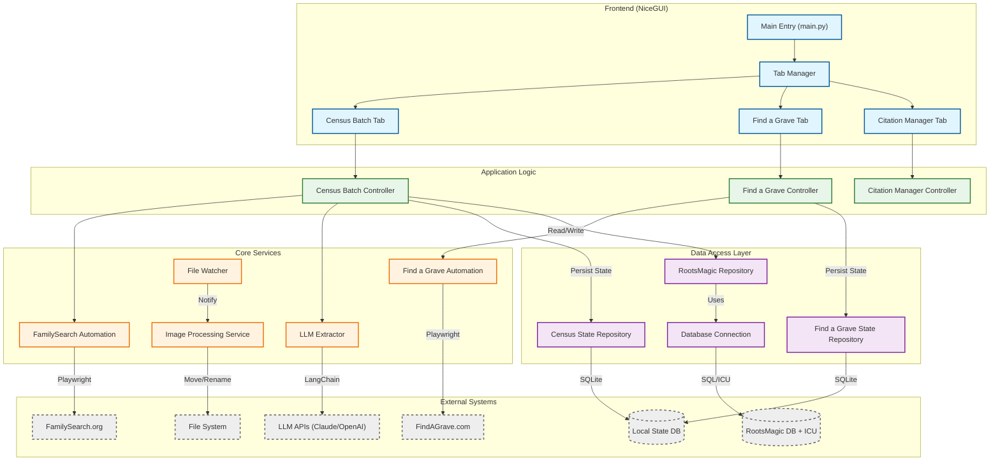

# RMCitecraft Architecture Diagram

This diagram illustrates the high-level architecture of the RMCitecraft application, showing the relationships between the UI, controllers, services, data access layer, and external systems.

