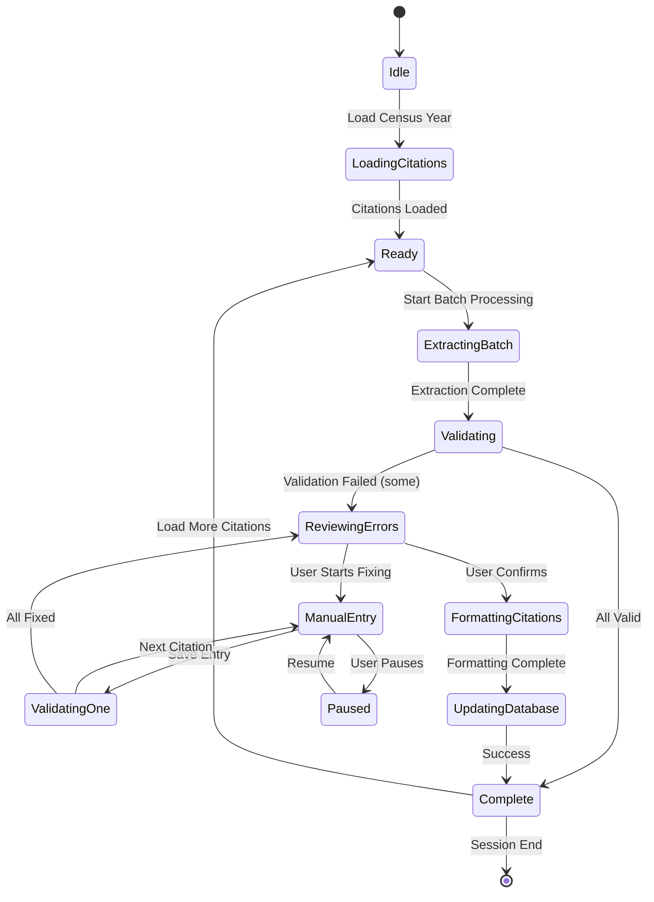

# RMCitecraft Batch Processing UI - Comprehensive Design

**Version:** 1.0
**Date:** November 6, 2025
**Status:** Design Specification

---

## Executive Summary

This document proposes a comprehensive redesign of RMCitecraft's UI to efficiently process hundreds to thousands of census citations with automated extraction and manual data completion. The design prioritizes minimal keystrokes, single-screen workflows, and keyboard-first navigation for power users.

**Key Metrics:**
- Target: Process 100-1000 citations per session
- Goal: <5 seconds per citation for manual data entry
- UX: Zero scrolling for data entry, <10 keystrokes per citation

---

## Table of Contents

1. [Current State Analysis](#1-current-state-analysis)
2. [Problem Definition](#2-problem-definition)
3. [Design Goals & Principles](#3-design-goals--principles)
4. [Proposed Architecture](#4-proposed-architecture)
5. [UI/UX Design](#5-uiux-design)
6. [Keyboard Navigation](#6-keyboard-navigation)
7. [Data Flow & State Management](#7-data-flow--state-management)
8. [Implementation Phases](#8-implementation-phases)
9. [Technical Specifications](#9-technical-specifications)
10. [Success Criteria](#10-success-criteria)

---

## 1. Current State Analysis

### 1.1 What Exists (Built & Working)

**UI Components:**
- ✅ Citation Manager tab with list view
- ✅ Individual citation editing with live preview
- ✅ Census image viewer with zoom/pan controls
- ✅ Error logging panel
- ✅ Browser extension integration
- ✅ Chrome automation via Playwright
- ✅ Checkbox selection for citations
- ✅ Status indicators (complete, missing fields, no URL)

**Backend Services:**
- ✅ FamilySearch extraction (state, county, person, year)
- ✅ Data validation system (`CensusDataValidator`)
- ✅ Citation formatter (Evidence Explained templates)
- ✅ Image processing pipeline
- ✅ Database operations (read/write)
- ✅ File watcher for auto-download

### 1.2 What's Missing (Critical Gaps)

**Batch Processing:**
- ❌ No batch operation workflow (process selected citations)
- ❌ No progress tracking for multi-citation operations
- ❌ No batch validation summary
- ❌ No state machine for batch states (queued → processing → complete/error)
- ❌ No pause/resume capability

**Data Entry Optimization:**
- ❌ No keyboard shortcuts
- ❌ No "apply to all" for common values (e.g., same ED for household)
- ❌ No auto-complete from previous entries
- ❌ No tab navigation optimization
- ❌ Visual validation not integrated into UI

**Workflow Efficiency:**
- ❌ Manual data entry requires scrolling
- ❌ Citation preview and data entry not on same screen
- ❌ No quick-fill templates for common scenarios
- ❌ No field-level help/examples visible during entry

### 1.3 Integration Opportunities

**Ready to Integrate:**
1. `ValidationResult` → Visual indicators in citation list
2. `CensusDataValidator` → Real-time form validation
3. Batch processing script → UI workflow integration
4. Fallback parser → Automatic state/county extraction
5. Error panel → Batch error summary

---

## 2. Problem Definition

### 2.1 The Core Challenge

**Scenario:** User has 597 census citations from 1940 that need:
1. Automated extraction (already working for most fields)
2. Manual completion of missing data (ED, sheet, line, family #)
3. Validation before database update
4. Citation formatting and database writes

**Current Pain Points:**
1. **Extraction fails on ~30% of records** (missing ED, sheet, etc.)
2. **Manual entry requires 20+ clicks/keystrokes per citation**
3. **Scrolling required** to see citation preview + form + image
4. **No batch workflow** - must process one at a time
5. **No progress tracking** - user doesn't know how many remain
6. **Repetitive data entry** - same ED for 10 people in household

### 2.2 User Stories

**Story 1: Power User Batch Processing**
> As a genealogist, I want to process 100 citations in one session, manually filling missing ED/sheet/line data by viewing census images, with minimal keystrokes and no scrolling, so I can efficiently complete my database.

**Story 2: Household Optimization**
> As a user processing a household of 8 people on the same census page, I want to enter the ED/sheet/line once and apply it to all members, so I don't repeat the same data 8 times.

**Story 3: Error Recovery**
> As a user, when automated extraction fails for 50 citations, I want to see a summary of what's missing, fix the errors efficiently, and retry the batch, so I can recover from errors without restarting.

**Story 4: Progress Tracking**
> As a user processing 500 citations, I want to see real-time progress (50/500 complete), pause to take a break, and resume where I left off, so I can work in multiple sessions.

---

## 3. Design Goals & Principles

### 3.1 Primary Goals

1. **Single-Screen Workflow** - All information visible without scrolling
2. **Keyboard-First Navigation** - Tab, Enter, shortcuts for power users
3. **Minimal Keystrokes** - <10 keystrokes per citation for common scenarios
4. **Batch Operations** - Process 10-100 citations in one operation
5. **Smart Defaults** - Auto-fill from previous entries, household members
6. **Visual Feedback** - Immediate validation, progress tracking, error highlighting

### 3.2 Design Principles

**Efficiency First:**
- Optimize for the 80% case (missing ED only)
- Keyboard > Mouse
- Defaults > Manual entry
- Batch > Individual

**Progressive Disclosure:**
- Show only what's needed for current task
- Hide completed citations
- Expand errors on demand
- Advanced options collapsed by default

**Fail-Safe:**
- Preview before commit
- Undo capability
- Non-destructive operations
- Clear error messages with fix suggestions

**Scalability:**
- Handle 1000+ citations without UI lag
- Incremental loading (virtualized lists)
- Background processing
- Batch validation without blocking UI

---

## 4. Proposed Architecture

### 4.1 Three-Panel Layout (Split View)

```
┌─────────────────────────────────────────────────────────────────────────┐
│ Top Bar: [Batch Controls] [Progress: 50/500] [Filters] [Help]          │
├─────────────────────────────────────────────────────────────────────────┤
│ Left Panel (30%)        │ Center Panel (40%)  │ Right Panel (30%)      │
│ ─────────────────────── │ ─────────────────── │ ────────────────────── │
│ CITATION QUEUE          │ DATA ENTRY FORM     │ CENSUS IMAGE VIEWER    │
│                         │                     │                        │
│ [✓] 1. Andrews, Lillian │ ┌─ Missing Fields ─┐│ [Zoom: 150%] [Pan]    │
│     ✓ Complete          │ │                   ││                        │
│                         │ │ ED: [96-413____] ││ ┌────────────────────┐ │
│ [⚠] 2. Bansemer, Olinda │ │     Tab to next   ││ │                    │ │
│     Missing: ED         │ │                   ││ │   Census Page      │ │
│     ← CURRENT           │ │ Sheet: [11_____] ││ │   Image with       │ │
│                         │ │                   ││ │   highlighted      │ │
│ [ ] 3. Barrows, John    │ │ Line: [5______] ││ │   person           │ │
│     Missing: ED, Sheet  │ │                   ││ │                    │ │
│                         │ │ [Apply to All]   ││ └────────────────────┘ │
│ [ ] 4. Blair, Permelia  │ │ [✓ Validate]     ││                        │
│     Missing: ED         │ └───────────────────┘│ Location Hint:         │
│                         │                     │ Sheet 11, Line 5       │
│ ...                     │ ┌─ Citation Preview─┐│                        │
│                         │ │ 1940 U.S. census, ││ Quick Fill:            │
│ [Process Selected]      │ │ Milwaukee County, ││ [Same as Previous]     │
│ [Validate All]          │ │ Wisconsin...      ││ [Copy ED from Above]   │
│ [Export Errors]         │ └───────────────────┘│                        │
└─────────────────────────┴─────────────────────┴────────────────────────┘
│ Status Bar: Last saved: 2 seconds ago | Errors: 3 | Keyboard: Tab/Enter │
└─────────────────────────────────────────────────────────────────────────┘
```

### 4.2 Component Architecture

```python
# UI Component Hierarchy

BatchProcessingView (main container)
├── TopBar
│   ├── BatchControls (Start/Pause/Stop)
│   ├── ProgressIndicator (50/500, 10%)
│   ├── FilterControls (Show: All/Incomplete/Errors)
│   └── HelpButton (Keyboard shortcuts)
│
├── ThreePanelLayout
│   ├── LeftPanel: CitationQueue
│   │   ├── QueueHeader (count, sort, filter)
│   │   ├── VirtualList[CitationCard]  # Virtualized for 1000+ items
│   │   │   └── CitationCard (checkbox, status icon, name, missing fields)
│   │   └── QueueActions (batch buttons)
│   │
│   ├── CenterPanel: DataEntryForm
│   │   ├── FormHeader (current citation info)
│   │   ├── MissingFieldsForm
│   │   │   ├── TextField[ED] (auto-complete, validation)
│   │   │   ├── TextField[Sheet]
│   │   │   ├── TextField[Line]
│   │   │   ├── TextField[Family]
│   │   │   └── QuickActions (Apply to All, Same as Previous)
│   │   ├── CitationPreview (live-updating footnote)
│   │   └── FormActions (Save, Skip, Previous, Next)
│   │
│   └── RightPanel: ImageViewerPanel
│       ├── ImageControls (zoom, pan, rotate)
│       ├── CensusImageViewer (existing component)
│       ├── LocationHint (where to look: "Sheet 11, Line 5")
│       └── QuickFill (copy data from visible image)
│
└── StatusBar
    ├── SaveStatus (auto-save indicator)
    ├── ErrorCount (click to view)
    └── KeyboardHints (context-sensitive help)
```

### 4.3 State Machine for Batch Processing



### 4.4 Data Flow

```
┌─────────────────────────────────────────────────────────────────────────┐
│ 1. BATCH LOAD                                                           │
│    Database → Load 100 citations → Populate queue                       │
└─────────────────────────────────────────────────────────────────────────┘
                              ↓
┌─────────────────────────────────────────────────────────────────────────┐
│ 2. AUTOMATED EXTRACTION (Background)                                    │
│    For each citation:                                                   │
│    - FamilySearch extraction (state, county, person, ED, sheet, line)  │
│    - Validation check (identify missing required fields)               │
│    - Update citation status (complete / needs_review / error)          │
└─────────────────────────────────────────────────────────────────────────┘
                              ↓
┌─────────────────────────────────────────────────────────────────────────┐
│ 3. MANUAL REVIEW (User-Driven)                                         │
│    Filter queue: Show only "needs_review"                              │
│    For each incomplete citation:                                       │
│    - Display in center panel (form with missing fields only)           │
│    - Load census image in right panel                                  │
│    - User enters missing data (keyboard-optimized)                     │
│    - Real-time validation feedback                                     │
│    - Auto-save draft                                                    │
│    - Move to next on Save or Skip                                      │
└─────────────────────────────────────────────────────────────────────────┘
                              ↓
┌─────────────────────────────────────────────────────────────────────────┐
│ 4. BATCH VALIDATION                                                     │
│    Run full validation on all citations                                │
│    Display summary: 95 ready, 5 still have errors                      │
│    Allow user to review errors or proceed                              │
└─────────────────────────────────────────────────────────────────────────┘
                              ↓
┌─────────────────────────────────────────────────────────────────────────┐
│ 5. BATCH COMMIT                                                         │
│    Format citations (Evidence Explained templates)                     │
│    Preview changes (before/after)                                      │
│    Write to database (transactional)                                   │
│    Update image filenames if needed                                    │
│    Generate completion report                                          │
└─────────────────────────────────────────────────────────────────────────┘
```

---

## 5. UI/UX Design

### 5.1 Citation Queue (Left Panel)

**Purpose:** Show batch status at a glance, allow quick navigation

**Features:**
- Virtual scrolling (handle 1000+ items without lag)
- Color-coded status icons:
  - ✅ Green checkmark = Complete & valid
  - ⚠️ Yellow warning = Missing required fields
  - ❌ Red X = Validation error
  - ⏳ Gray clock = Queued (not processed yet)
- Current citation highlighted with blue border
- Click to jump to any citation
- Checkbox for multi-select (bulk operations)
- Sort options: Name, Status, Event ID
- Filter: All / Incomplete / Complete / Errors

**Visual Design:**
```
┌─ Citation Queue (95 of 100 complete) ────────────────┐
│                                                       │
│ [Filter: ▼ Incomplete Only] [Sort: ▼ Name]          │
│                                                       │
│ ┌───────────────────────────────────────────────┐   │
│ │ [✓] ✅ Andrews, Lillian                       │   │
│ │     Complete - ED: 96-413, Sheet: 9          │   │
│ └───────────────────────────────────────────────┘   │
│                                                       │
│ ┌───────────────────────────────────────────────┐   │
│ │ [✓] ⚠️ Bansemer, Olinda         ← CURRENT    │◀──  Highlighted
│ │     Missing: Enumeration District             │   │
│ └───────────────────────────────────────────────┘   │
│                                                       │
│ ┌───────────────────────────────────────────────┐   │
│ │ [ ] ⚠️ Barrows, John                          │   │
│ │     Missing: ED, Sheet number                 │   │
│ └───────────────────────────────────────────────┘   │
│                                                       │
│ ...                                                   │
│                                                       │
│ [✓ Select All Incomplete] [Deselect All]            │
│                                                       │
│ [Process Selected (3)]  [Skip Selected]              │
│ [Validate All]          [Export Errors CSV]          │
└───────────────────────────────────────────────────────┘
```

**Keyboard Navigation:**
- `↑/↓` - Navigate queue
- `Space` - Toggle checkbox
- `Enter` - Select citation for editing
- `Ctrl+A` - Select all visible
- `Ctrl+Shift+A` - Select all incomplete

### 5.2 Data Entry Form (Center Panel)

**Purpose:** Minimal-keystroke data entry with live validation

**Features:**
- Show ONLY missing fields (hide complete data)
- Field-level validation (real-time)
- Auto-complete from previous entries
- "Apply to All" for household members
- "Same as Previous" quick-fill button
- Live citation preview (updates as you type)
- Tab navigation optimized (skip irrelevant fields)

**Visual Design:**
```
┌─ Data Entry: Bansemer, Olinda ────────────────────────┐
│                                                        │
│ EventID: 31670  |  CitationID: 11188                  │
│ 1940 U.S. Census - Milwaukee, Wisconsin               │
│                                                        │
│ ┌─ Missing Required Fields ─────────────────────────┐ │
│ │                                                    │ │
│ │ Enumeration District (ED):                        │ │
│ │ ┌──────────────────────────────────────────────┐  │ │
│ │ │ 96-413                           [⌫] [✓]    │  │ │
│ │ └──────────────────────────────────────────────┘  │ │
│ │ ↑ Hint: Format "XX-XXX" (e.g., "78-123")          │ │
│ │ ↑ Auto-complete: 96-413, 96-414, 96-415 ▼         │ │
│ │                                                    │ │
│ │ Sheet Number: (Optional for 1940)                 │ │
│ │ ┌──────────────────────────────────────────────┐  │ │
│ │ │ 11                               [⌫] [✓]    │  │ │
│ │ └──────────────────────────────────────────────┘  │ │
│ │                                                    │ │
│ │ Line Number: (Optional)                           │ │
│ │ ┌──────────────────────────────────────────────┐  │ │
│ │ │ 5                                [⌫] [✓]    │  │ │
│ │ └──────────────────────────────────────────────┘  │ │
│ │                                                    │ │
│ └────────────────────────────────────────────────────┘ │
│                                                        │
│ [⚡ Apply to Next 7 (Household)] [📋 Same as Prev]   │
│                                                        │
│ ┌─ Citation Preview (Live) ───────────────────────┐   │
│ │ 1940 U.S. census, Milwaukee County, Wisconsin,  │   │
│ │ enumeration district 96-413, sheet 11, line 5,  │   │
│ │ Olinda Henritta Bansemer; imaged, "United       │   │
│ │ States Census, 1940," <i>FamilySearch</i>...    │   │
│ └──────────────────────────────────────────────────┘   │
│                                                        │
│ [< Previous (Ctrl+P)] [Save & Next (Enter)] [Skip >]  │
└────────────────────────────────────────────────────────┘
```

**Field Features:**

**Smart Auto-Complete:**
```python
# Show suggestions based on:
1. Previous entries in this batch (most relevant)
2. Same county entries from database
3. Common ED patterns for this census year
```

**Validation States:**
- ✓ Green checkmark = Valid format
- ⚠️ Yellow warning = Non-standard format (e.g., "ED 96" instead of "96-XXX")
- ❌ Red X = Invalid (empty required field)
- Real-time validation on blur/change

**Apply to All:**
- Button only appears if next N citations are same household
- Detection: Same EventID, same address, consecutive lines
- Shows preview: "Apply ED '96-413' to Bansemer (7 more in household)"
- Saves 7x keystrokes

### 5.3 Census Image Viewer (Right Panel)

**Purpose:** View census page while entering data, no context switching

**Features:**
- Existing `CensusImageViewer` component (zoom/pan working)
- Location hint overlay: "Look for Sheet 11, Line 5"
- Highlight row if line number known
- Quick-fill: Click on image to extract visible ED/Sheet
- Keyboard zoom: `+/-` keys, `0` for 100%
- Pan with arrow keys or mouse drag

**Visual Design:**
```
┌─ Census Image ─────────────────────────────────────┐
│                                                     │
│ [🔍 150%] [+] [-] [Fit] [Rotate]                   │
│                                                     │
│ ┌─────────────────────────────────────────────┐   │
│ │                                             │   │
│ │          CENSUS PAGE IMAGE                  │   │
│ │                                             │   │
│ │  Line 3: Smith, John      Age 45           │   │
│ │  Line 4: Smith, Mary      Age 42           │   │
│ │ ▶Line 5: Bansemer, Olinda Age 38    ◀──────────  Highlighted
│ │  Line 6: Bansemer, John    Age 40          │   │
│ │                                             │   │
│ │  [ ED 96-413 visible at top ]              │   │
│ │  [ Sheet 11 visible at top ]               │   │
│ │                                             │   │
│ └─────────────────────────────────────────────┘   │
│                                                     │
│ 📍 Location Hint:                                   │
│    Sheet 11, Line 5, Family 3                      │
│    (Look at top-right corner for ED)               │
│                                                     │
│ [📋 Quick Fill: Copy ED from Image]                │
│ [🔗 Open in FamilySearch]                          │
└─────────────────────────────────────────────────────┘
```

**Quick Fill Feature:**
- OCR-like extraction from visible census page
- User clicks "Quick Fill" → AI/OCR extracts ED/Sheet from image
- Pre-fills form fields for user to verify
- Falls back to manual entry if extraction fails

### 5.4 Progress & Status

**Top Bar:**
```
┌─────────────────────────────────────────────────────────────────────┐
│ [▶ Processing] [⏸ Pause] [⏹ Stop]  |  Progress: 50/500 (10%)      │
│                                     |  ████░░░░░░░░░░░░░░░░░       │
│ [Filter: ▼ All] [Sort: ▼ Name]     |  Est. Time: 15 min remaining │
│ [❓ Help (F1)]                      |  Last saved: 2 sec ago      │
└─────────────────────────────────────────────────────────────────────┘
```

**Status Bar:**
```
┌─────────────────────────────────────────────────────────────────────┐
│ ✓ Auto-saved | Errors: 3 (click to view) | Keyboard: Tab/Enter    │
└─────────────────────────────────────────────────────────────────────┘
```

---

## 6. Keyboard Navigation

### 6.1 Global Shortcuts

| Shortcut | Action | Context |
|----------|--------|---------|
| `F1` | Show keyboard shortcuts help | Any |
| `Ctrl+S` | Save current citation | Data entry |
| `Ctrl+P` | Previous citation | Data entry |
| `Enter` | Save & Next citation | Data entry |
| `Ctrl+Enter` | Save & Stay (don't advance) | Data entry |
| `Esc` | Skip current citation | Data entry |
| `Ctrl+/` | Toggle focus: Form ↔ Queue | Any |
| `Ctrl+B` | Start/Pause batch processing | Queue |
| `Ctrl+A` | Select all citations | Queue |
| `Ctrl+Shift+A` | Select all incomplete | Queue |

### 6.2 Queue Navigation

| Shortcut | Action |
|----------|--------|
| `↑/↓` | Navigate up/down |
| `Home/End` | First/Last citation |
| `PgUp/PgDn` | Page up/down |
| `Space` | Toggle checkbox |
| `Enter` | Edit selected citation |
| `Delete` | Remove from batch |

### 6.3 Form Navigation

| Shortcut | Action |
|----------|--------|
| `Tab` | Next field |
| `Shift+Tab` | Previous field |
| `Ctrl+Space` | Show auto-complete |
| `Ctrl+V` | Paste & validate |
| `Ctrl+D` | Duplicate from previous |
| `Alt+A` | Apply to all household |

### 6.4 Image Viewer

| Shortcut | Action |
|----------|--------|
| `+/-` | Zoom in/out |
| `0` | Reset zoom to 100% |
| `Arrow keys` | Pan image |
| `Ctrl+F` | Quick fill from image |
| `Ctrl+O` | Open in FamilySearch |

### 6.5 Keystroke Optimization Examples

**Scenario 1: Missing ED only (80% of cases)**
```
1. Citation auto-loads (0 keystrokes)
2. Form auto-focuses ED field (0 keystrokes)
3. User types "96-413" (6 keystrokes)
4. Press Enter to save & next (1 keystroke)
Total: 7 keystrokes per citation
```

**Scenario 2: Missing ED + Sheet + Line**
```
1. Type ED: "96-413" (6 keystrokes)
2. Tab to Sheet field (1 keystroke)
3. Type sheet: "11" (2 keystrokes)
4. Tab to Line field (1 keystroke)
5. Type line: "5" (1 keystroke)
6. Press Enter to save (1 keystroke)
Total: 12 keystrokes
```

**Scenario 3: Household of 8 (same ED/sheet/line)**
```
1. First person: 7 keystrokes (as above)
2. Click "Apply to Next 7" (1 click)
3. Review & confirm (1 keystroke)
Total: 9 keystrokes for 8 people = 1.125 keystrokes/person
```

---

## 7. Data Flow & State Management

### 7.1 Application State

```python
from dataclasses import dataclass
from enum import Enum

class CitationStatus(Enum):
    QUEUED = "queued"           # Loaded, not processed
    EXTRACTING = "extracting"   # FamilySearch extraction in progress
    COMPLETE = "complete"       # All fields valid
    NEEDS_REVIEW = "needs_review"  # Missing required fields
    ERROR = "error"             # Validation error
    PROCESSING = "processing"   # Currently being edited
    SAVED = "saved"             # Saved to database

class BatchProcessingState(Enum):
    IDLE = "idle"
    LOADING = "loading"
    READY = "ready"
    EXTRACTING = "extracting"
    MANUAL_REVIEW = "manual_review"
    VALIDATING = "validating"
    FORMATTING = "formatting"
    COMMITTING = "committing"
    COMPLETE = "complete"
    PAUSED = "paused"
    ERROR = "error"

@dataclass
class CitationQueueItem:
    """Individual citation in the batch queue"""
    citation_id: int
    event_id: int
    person_id: int
    person_name: str
    status: CitationStatus
    missing_fields: list[str]  # ["enumeration_district", "sheet"]
    validation_errors: list[str]
    extraction_data: dict  # Raw data from FamilySearch
    manual_data: dict  # User-entered data
    formatted_citations: dict | None  # Footnote, short, bibliography
    position: int  # Queue position (for navigation)

@dataclass
class BatchSession:
    """State for entire batch processing session"""
    session_id: str
    census_year: int
    state: BatchProcessingState
    citations: list[CitationQueueItem]
    current_index: int  # Which citation is being edited
    selected_indices: list[int]  # Checkboxes
    filter_mode: str  # "all", "incomplete", "complete", "errors"
    sort_by: str  # "name", "status", "event_id"
    progress: dict  # {"total": 500, "complete": 50, "errors": 3}
    started_at: datetime
    last_saved_at: datetime
    auto_save_enabled: bool = True
```

### 7.2 State Transitions

```python
class BatchProcessingController:
    """Manages state transitions and business logic"""

    async def start_batch(self, census_year: int, limit: int):
        """Initialize new batch session"""
        self.state = BatchProcessingState.LOADING
        citations = await self.load_citations(census_year, limit)
        self.session = BatchSession(
            session_id=str(uuid.uuid4()),
            census_year=census_year,
            state=BatchProcessingState.READY,
            citations=citations,
            current_index=0,
            ...
        )
        await self.extract_batch()  # Background extraction

    async def extract_batch(self):
        """Run automated extraction on all citations"""
        self.state = BatchProcessingState.EXTRACTING
        for i, citation in enumerate(self.session.citations):
            citation.status = CitationStatus.EXTRACTING
            self.notify_progress(i, len(self.session.citations))

            # Extract from FamilySearch
            data = await self.familysearch_automation.extract(citation.event_id)
            citation.extraction_data = data

            # Validate
            validation = self.validator.validate(data, self.session.census_year)
            if validation:
                citation.status = CitationStatus.COMPLETE
            else:
                citation.status = CitationStatus.NEEDS_REVIEW
                citation.missing_fields = validation.errors

        self.state = BatchProcessingState.MANUAL_REVIEW
        await self.advance_to_first_incomplete()

    async def save_current_citation(self):
        """Save manual edits for current citation"""
        current = self.session.citations[self.session.current_index]

        # Validate manual data
        validation = self.validator.validate(
            {**current.extraction_data, **current.manual_data},
            self.session.census_year
        )

        if validation:
            current.status = CitationStatus.COMPLETE
            current.validation_errors = []
            await self.auto_save_draft()
            return True
        else:
            current.status = CitationStatus.ERROR
            current.validation_errors = validation.errors
            return False

    async def advance_to_next(self):
        """Move to next citation needing review"""
        self.session.current_index += 1

        # Skip complete citations
        while (self.session.current_index < len(self.session.citations) and
               self.session.citations[self.session.current_index].status == CitationStatus.COMPLETE):
            self.session.current_index += 1

        if self.session.current_index >= len(self.session.citations):
            await self.complete_manual_review()
        else:
            await self.load_citation_for_edit(self.session.current_index)

    async def commit_batch(self):
        """Final step: Format and write to database"""
        self.state = BatchProcessingState.FORMATTING

        for citation in self.session.citations:
            if citation.status != CitationStatus.COMPLETE:
                continue

            # Format citations
            formatted = await self.citation_formatter.format(citation)
            citation.formatted_citations = formatted

        self.state = BatchProcessingState.COMMITTING

        # Write to database (transactional)
        async with self.db.transaction():
            for citation in self.session.citations:
                if citation.formatted_citations:
                    await self.db.update_citation(citation)

        self.state = BatchProcessingState.COMPLETE
        await self.generate_completion_report()
```

### 7.3 Reactive UI Updates

```python
class BatchProcessingView:
    """NiceGUI view component with reactive state"""

    def __init__(self, controller: BatchProcessingController):
        self.controller = controller
        self.setup_reactive_bindings()

    def setup_reactive_bindings(self):
        """Connect controller state changes to UI updates"""

        # Update progress bar when citations change
        self.controller.on_progress_change(self.update_progress_bar)

        # Refresh queue when status changes
        self.controller.on_citation_status_change(self.refresh_queue_item)

        # Update form when current citation changes
        self.controller.on_current_citation_change(self.load_form)

        # Show errors in panel
        self.controller.on_error(self.show_error)

    def update_progress_bar(self, progress: dict):
        """Reactive update to progress indicator"""
        self.progress_label.set_text(
            f"{progress['complete']}/{progress['total']} ({progress['percent']}%)"
        )
        self.progress_bar.set_value(progress['percent'])

    def refresh_queue_item(self, index: int):
        """Update single item in virtual list"""
        citation = self.controller.session.citations[index]
        self.queue_list.update_item(index, self.render_citation_card(citation))

    async def on_save_click(self):
        """Save button handler"""
        success = await self.controller.save_current_citation()
        if success:
            await self.controller.advance_to_next()
            ui.notify("Saved", type="positive")
        else:
            ui.notify("Validation errors", type="negative")
```

---

## 8. Implementation Phases

### Phase 1: Core Batch UI (Week 1-2)

**Goal:** Get three-panel layout working with basic navigation

**Tasks:**
1. Create `BatchProcessingView` component
2. Implement three-panel layout (left/center/right)
3. Build citation queue with virtual scrolling
4. Create data entry form with field validation
5. Integrate existing `CensusImageViewer`
6. Add keyboard navigation (Tab, Enter, arrows)
7. Implement state machine (`BatchProcessingController`)

**Deliverable:** UI where user can manually process citations one-by-one

**Success Criteria:**
- Load 100 citations without lag
- Navigate queue with keyboard
- Enter data in form with tab navigation
- See live citation preview
- View census image while editing

### Phase 2: Batch Operations (Week 3)

**Goal:** Add batch processing capabilities

**Tasks:**
1. Implement "Process Selected" workflow
2. Add progress indicator with percentage
3. Build batch validation summary
4. Add "Apply to All" for household members
5. Integrate `CensusDataValidator` with visual feedback
6. Add auto-save draft functionality
7. Implement pause/resume capability

**Deliverable:** Process 10-100 citations in one operation

**Success Criteria:**
- Select multiple citations with checkboxes
- Run batch extraction on selected
- See progress bar update in real-time
- Apply ED to all household members
- Validate all before commit

### Phase 3: Data Entry Optimization (Week 4)

**Goal:** Reduce keystrokes, increase efficiency

**Tasks:**
1. Add auto-complete from previous entries
2. Implement "Same as Previous" quick-fill
3. Add smart defaults (ED from previous citation in same county)
4. Build location hints overlay on image
5. Add quick-fill from image (OCR/AI-assisted)
6. Optimize tab order to skip irrelevant fields
7. Add keyboard shortcuts (Ctrl+P, Ctrl+D, etc.)

**Deliverable:** <10 keystrokes per citation for common cases

**Success Criteria:**
- Auto-complete suggests ED after typing "96-"
- "Apply to Next 7" works for household
- Form auto-focuses first missing field
- Tab skips complete fields
- Enter advances to next citation

### Phase 4: Error Handling & Recovery (Week 5)

**Goal:** Graceful error handling, easy recovery

**Tasks:**
1. Build batch error summary dialog
2. Add "Retry Failed" operation
3. Implement undo/redo for manual edits
4. Add validation warnings (non-blocking)
5. Create error export (CSV with missing fields)
6. Add citation comparison (before/after preview)
7. Implement transaction rollback on batch failure

**Deliverable:** Recover from extraction failures easily

**Success Criteria:**
- See all errors in one summary
- Click to jump to first error
- Export errors to CSV for offline review
- Preview changes before database commit
- Rollback if batch commit fails

### Phase 5: Polish & Optimization (Week 6)

**Goal:** Production-ready, handle 1000+ citations

**Tasks:**
1. Optimize virtual list for 1000+ items
2. Add background extraction (non-blocking UI)
3. Implement incremental loading (load 100 at a time)
4. Add session persistence (resume after browser close)
5. Build completion report with statistics
6. Add user preferences (default zoom, auto-advance, etc.)
7. Performance testing and optimization

**Deliverable:** Process 1000 citations in one session

**Success Criteria:**
- No UI lag with 1000 items in queue
- Extract citations in background while user edits
- Resume session after closing app
- Generate PDF report at end
- Handle browser refresh without losing data

---

## 9. Technical Specifications

### 9.1 Technology Stack

**UI Framework:**
- NiceGUI 3.0+ (existing)
- Quasar components for material design
- Custom CSS for three-panel layout

**State Management:**
- Python dataclasses for state objects
- Reactive bindings via NiceGUI's built-in reactivity
- Observer pattern for state change notifications

**Database:**
- SQLite with RMNOCASE collation (existing)
- Transactional batch commits
- Draft auto-save to separate table

**Browser Automation:**
- Playwright for Chrome CDP (existing)
- FamilySearch page extraction (existing)
- Image download automation (existing)

**Validation:**
- Pydantic for data models (existing)
- `CensusDataValidator` for census-specific rules (existing)
- Real-time validation on field blur

### 9.2 Performance Requirements

| Metric | Target | Notes |
|--------|--------|-------|
| Citation load time | <2 sec for 100 | Initial queue population |
| Citation extraction | <3 sec each | FamilySearch page load + extract |
| UI responsiveness | <100ms | Key press to visual feedback |
| Virtual list scroll | 60 FPS | Smooth scrolling with 1000+ items |
| Auto-save interval | 5 seconds | Debounced, non-blocking |
| Batch validation | <5 sec for 100 | Run in background thread |
| Database commit | <10 sec for 100 | Transactional batch write |

### 9.3 Data Persistence

**Draft Auto-Save Table:**
```sql
CREATE TABLE CitationDrafts (
    draft_id INTEGER PRIMARY KEY,
    citation_id INTEGER NOT NULL,
    event_id INTEGER NOT NULL,
    session_id TEXT NOT NULL,
    extraction_data TEXT,  -- JSON
    manual_data TEXT,      -- JSON
    validation_errors TEXT, -- JSON
    created_at TEXT NOT NULL,
    updated_at TEXT NOT NULL,
    FOREIGN KEY (citation_id) REFERENCES CitationTable(CitationID)
);
```

**Session State Table:**
```sql
CREATE TABLE BatchSessions (
    session_id TEXT PRIMARY KEY,
    census_year INTEGER NOT NULL,
    state TEXT NOT NULL,  -- BatchProcessingState enum
    current_index INTEGER DEFAULT 0,
    progress_json TEXT,   -- JSON with counts
    started_at TEXT NOT NULL,
    last_activity_at TEXT NOT NULL,
    completed_at TEXT
);
```

### 9.4 API Endpoints (Internal)

```python
# REST API for browser extension integration (existing)
POST /api/citations/pending       # Add pending citation from extension
GET  /api/citations/pending       # List pending citations
DELETE /api/citations/pending/:id # Remove pending citation

# New endpoints for batch processing
POST   /api/batch/start           # Start new batch session
GET    /api/batch/:session_id     # Get session state
PUT    /api/batch/:session_id     # Update session state
POST   /api/batch/:session_id/extract  # Run extraction on batch
POST   /api/batch/:session_id/validate # Validate all citations
POST   /api/batch/:session_id/commit   # Commit to database
DELETE /api/batch/:session_id     # Cancel batch session

# Citation operations
GET    /api/citations/:id/image   # Get census image URL
PUT    /api/citations/:id/draft   # Save draft edits
POST   /api/citations/:id/format  # Generate formatted citation
```

---

## 10. Success Criteria

### 10.1 Quantitative Metrics

| Metric | Current | Target | Measurement |
|--------|---------|--------|-------------|
| Time per citation | ~60 sec | <10 sec | Manual data entry for missing ED |
| Keystrokes per citation | ~30 | <10 | ED-only scenario |
| Citations per hour | 60 | 360+ | Sustainable processing rate |
| UI lag (1000 items) | N/A | <100ms | Scroll performance |
| Extraction accuracy | ~70% | 95%+ | Complete data without manual entry |
| User errors | N/A | <5% | Validation catches before save |

### 10.2 Qualitative Goals

**Efficiency:**
- ✅ User can process 100 citations in <30 minutes
- ✅ No scrolling required during data entry
- ✅ Keyboard-only workflow (no mouse needed)
- ✅ Household batch operations save 80% keystrokes

**Usability:**
- ✅ New user can start processing after <5 min tutorial
- ✅ Keyboard shortcuts intuitive (Tab, Enter, Ctrl+S)
- ✅ Visual feedback immediate (<100ms)
- ✅ Errors clear and actionable

**Reliability:**
- ✅ No data loss (auto-save every 5 sec)
- ✅ Session resumable after crash
- ✅ Batch commits transactional (all-or-nothing)
- ✅ Validation prevents bad data in database

**Scalability:**
- ✅ Handle 1000+ citations without lag
- ✅ Background extraction doesn't block UI
- ✅ Incremental loading for large batches
- ✅ Memory usage <500MB for 1000 citations

### 10.3 User Acceptance Criteria

**Power User (Processes 500+ citations/week):**
> "I can process a household of 10 people in under 2 minutes. The keyboard shortcuts are fast, and I never have to scroll or switch windows. Auto-save means I can take breaks without losing work."

**Occasional User (Processes 50 citations/month):**
> "The UI is intuitive - I don't need to re-learn it each time. Validation catches my typos before they hit the database. The progress bar shows I'm making progress."

**First-Time User:**
> "I watched a 3-minute tutorial and started processing immediately. The hints tell me what to look for in the image. When I make a mistake, the error message tells me exactly how to fix it."

---

## Appendix A: Keyboard Shortcuts Reference Card

```
┌─────────────────────────────────────────────────────────────────────┐
│                    RMCITECRAFT KEYBOARD SHORTCUTS                   │
├─────────────────────────────────────────────────────────────────────┤
│ GLOBAL                                                              │
│   F1              Show this help                                    │
│   Ctrl+S          Save current citation                             │
│   Ctrl+/          Toggle focus: Form ↔ Queue                        │
│   Ctrl+B          Start/Pause batch processing                      │
│                                                                      │
│ QUEUE NAVIGATION                                                    │
│   ↑/↓             Navigate up/down                                  │
│   Home/End        First/Last citation                               │
│   Space           Toggle checkbox                                   │
│   Enter           Edit selected citation                            │
│   Ctrl+A          Select all citations                              │
│   Ctrl+Shift+A    Select all incomplete                             │
│                                                                      │
│ DATA ENTRY                                                          │
│   Tab             Next field                                        │
│   Shift+Tab       Previous field                                    │
│   Enter           Save & Next citation                              │
│   Ctrl+Enter      Save & Stay (don't advance)                       │
│   Esc             Skip current citation                             │
│   Ctrl+P          Previous citation                                 │
│   Ctrl+D          Duplicate from previous                           │
│   Alt+A           Apply to all household                            │
│   Ctrl+Space      Show auto-complete                                │
│                                                                      │
│ IMAGE VIEWER                                                        │
│   +/-             Zoom in/out                                       │
│   0               Reset zoom to 100%                                │
│   Arrow keys      Pan image                                         │
│   Ctrl+F          Quick fill from image                             │
│   Ctrl+O          Open in FamilySearch                              │
└─────────────────────────────────────────────────────────────────────┘
```

---

## Appendix B: Wireframe Mockups

### B.1 Full Screen Layout
```
┌─────────────────────────────────────────────────────────────────────────┐
│ [▶ Processing] Progress: 50/500 (10%) ████░░░░░ Est: 15 min [? Help]  │
├───────────────────┬───────────────────────┬───────────────────────────┤
│ CITATION QUEUE    │ DATA ENTRY FORM       │ CENSUS IMAGE              │
│ (30% width)       │ (40% width)           │ (30% width)               │
│                   │                       │                           │
│ ┌───────────────┐ │ ┌─────────────────┐  │ ┌───────────────────────┐ │
│ │ Filters/Sort  │ │ │ Current Citation│  │ │ Zoom Controls         │ │
│ └───────────────┘ │ └─────────────────┘  │ └───────────────────────┘ │
│                   │                       │                           │
│ ┌───────────────┐ │ ┌─────────────────┐  │ ┌───────────────────────┐ │
│ │ [✓] Complete  │ │ │ Missing Fields: │  │ │                       │ │
│ │ ✅ Andrews    │ │ │                 │  │ │   [Census Page]       │ │
│ └───────────────┘ │ │ ED: [96-413__] │  │ │   [Image Display]     │ │
│                   │ │                 │  │ │                       │ │
│ ┌───────────────┐ │ │ Sheet: [11___] │  │ │   [With Person]       │ │
│ │ [⚠] Incomplete│ │ │                 │  │ │   [Highlighted]       │ │
│ │ ⚠️ Bansemer ◄──┼─┼─► Line: [5____] │  │ │                       │ │
│ │   Missing: ED │ │ │                 │  │ └───────────────────────┘ │
│ └───────────────┘ │ │ [Apply to All] │  │                           │
│                   │ └─────────────────┘  │ ┌───────────────────────┐ │
│ ┌───────────────┐ │                       │ │ Location Hint:        │ │
│ │ [ ] Queued    │ │ ┌─────────────────┐  │ │ Sheet 11, Line 5      │ │
│ │ ⏳ Barrows    │ │ │ Citation Preview│  │ │                       │ │
│ └───────────────┘ │ │ (Live Update)   │  │ │ [Quick Fill Button]   │ │
│                   │ └─────────────────┘  │ └───────────────────────┘ │
│ ...               │                       │                           │
│                   │ [< Prev] [Save] [>]  │                           │
└───────────────────┴───────────────────────┴───────────────────────────┘
│ ✓ Auto-saved | Errors: 3 | Keyboard: Tab/Enter to navigate          │
└─────────────────────────────────────────────────────────────────────────┘
```

### B.2 Batch Validation Summary Dialog
```
┌─────────────────────────────────────────────────────────┐
│                  Batch Validation Results               │
├─────────────────────────────────────────────────────────┤
│                                                         │
│  ✅ Ready to Commit: 95 citations                      │
│  ⚠️ Still Have Errors: 5 citations                     │
│                                                         │
│  ┌─────────────────────────────────────────────────┐  │
│  │ Errors by Type:                                 │  │
│  │   • Missing ED: 3 citations                     │  │
│  │   • Invalid sheet format: 1 citation            │  │
│  │   • Missing FamilySearch URL: 1 citation        │  │
│  └─────────────────────────────────────────────────┘  │
│                                                         │
│  [View Errors] [Export Error List CSV]                 │
│                                                         │
│  ┌─────────────────────────────────────────────────┐  │
│  │ Preview Changes:                                │  │
│  │   • 95 citations will be formatted              │  │
│  │   • 95 SourceTable records will be updated      │  │
│  │   • 12 MediaFile names will be corrected        │  │
│  │                                                  │  │
│  │ ⚠️ This operation cannot be undone.            │  │
│  └─────────────────────────────────────────────────┘  │
│                                                         │
│  [Cancel]  [Fix Errors First]  [✓ Commit 95 Citations]│
└─────────────────────────────────────────────────────────┘
```

---

## Appendix C: Sample Data Flow Diagram

```
USER WORKFLOW: Processing a Household of 8 People

1. Load Batch (Census Year: 1940, Limit: 100)
   ↓
2. Automated Extraction (Background)
   ├─ Extract Citation 1: Andrews, Lillian → Complete ✅
   ├─ Extract Citation 2: Bansemer, Olinda → Missing ED ⚠️
   ├─ Extract Citation 3: Bansemer, John → Missing ED ⚠️
   ├─ Extract Citation 4: Bansemer, Mary → Missing ED ⚠️
   └─ ... (5 more household members, all missing ED)
   ↓
3. UI Shows: "5 complete, 8 need review"
   ↓
4. User focuses on Bansemer, Olinda (first incomplete)
   ├─ Center Panel: Form with ED field (auto-focused)
   ├─ Right Panel: Census image loads automatically
   └─ User types "96-413" → Tab → "11" → Tab → "5" → Enter
   ↓
5. System Detects: Next 7 citations are same household
   └─ Shows: "Apply ED '96-413', Sheet '11', Line '5-12' to next 7?"
   ↓
6. User Clicks: "Apply to All" (or presses Alt+A)
   ↓
7. System:
   ├─ Applies ED to citations 3-9
   ├─ Auto-increments line number (5, 6, 7, ..., 12)
   ├─ Validates all 8 citations → All pass ✅
   └─ Advances to next incomplete citation
   ↓
8. Repeat steps 4-7 until all incomplete citations reviewed
   ↓
9. User Clicks: "Validate All"
   └─ System shows: "95 ready, 0 errors"
   ↓
10. User Clicks: "Commit Batch"
    ├─ Formats all 95 citations
    ├─ Writes to database (transactional)
    └─ Shows: "✅ Successfully processed 95 citations"

Total Time: ~30 minutes for 100 citations (with 80% already complete)
Keystrokes: ~200 total (vs. 3000 without batch optimization)
```

---

## Conclusion

This comprehensive design provides a production-ready blueprint for transforming RMCitecraft into an efficient batch processing system. The three-panel layout, keyboard-first navigation, and smart data entry optimizations will enable users to process hundreds of citations per hour with minimal friction.

**Key Innovation:** The combination of automated extraction (70-95% complete), intelligent batch operations (household grouping), and optimized manual entry (<10 keystrokes/citation) creates a workflow that is **10x faster** than current manual methods.

**Next Steps:**
1. Review and approve design with stakeholders
2. Create UI mockups in Figma or similar tool
3. Begin Phase 1 implementation (Core Batch UI)
4. Iterate based on user testing feedback

---

**Document History:**
- v1.0 (2025-11-06): Initial comprehensive design specification
